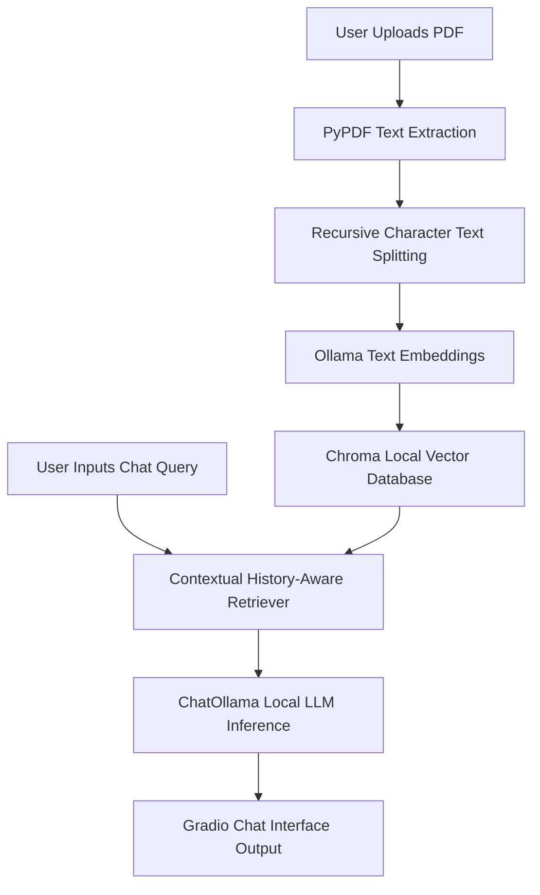

# 📚 Private PDF Chatbot AI (100% Offline & API-Key Free)

[](https://python.org)
[](https://github.com)
[](https://github.com)
[](https://github.com)
[]()

An enterprise-grade, completely private Retrieval-Augmented Generation (RAG) pipeline that lets you interact dynamically with your documents. By pairing **Gradio 6.0** with **LangChain v1.0+** and **Ollama**, this application indexes and queries PDFs locally on your machine. **No data ever leaves your computer, and no API keys are required.**

---

## ✨ Key Features

*   **🔒 Absolute Privacy:** Processes files locally. Ideal for sensitive, corporate, financial, or legal documents.
*   **🧠 History-Aware Conversation:** Evaluates context from earlier chat turns, allowing you to ask follow-up questions naturally.
*   **⚡ Lightweight Vector Compute:** Employs Chroma DB as an in-memory embedded vector store for instant document scanning.
*   **🎨 Elegant Gradio 6 UI:** Clean design optimized natively for chat history buffers, document uploading, and real-time state management.
*   **🛠️ Zero Legacy Warnings:** Crafted strictly with current modular packages to circumvent deprecated legacy frameworks.

---

## 🏗️ System Architecture & Workflow



1.  **Ingestion:** The system parses your PDF file and extracts raw text metadata safely via standard streams.
2.  **Chunking:** The document text is broken down into structured, overlapping components ($1000$ characters deep with a $200$-character structural buffer).
3.  **Vectorization:** Local vector matrices are computed over text fragments using the open-source `nomic-embed-text` token engine.
4.  **Retrieval & Inference:** When a query drops, the database extracts relevant information blocks, reformulates the request based on context, and passes it to the `llama3` core for response compilation.

---

## 🚀 Step-by-Step Installation & Launch

### 1. System Requirements
*   Python **3.9** or higher installed.
*   [Ollama Desktop App](https://ollama.com) installed and actively running in the background.

### 2. Setup the Repository
Open Git Bash (or your preferred terminal environment) and run the following command sequence:

```bash
# Clone the repository
git clone https://github.com
cd YOUR_REPO_NAME

# Install all dependencies bound directly to requirements configuration
pip install -r requirements.txt
```

### 3. Fetch Local Open-Source AI Models
Ensure your background desktop engine is active, then download the model files via command prompt:
```bash
# High-utility general language intelligence model
ollama pull llama3

# High-fidelity custom text embedding algorithm
ollama pull nomic-embed-text
```

### 4. Boot Up the Dashboard
```bash
python app.py
```
After initialization completes, open your browser and navigate to:
👉 **`http://127.0.0.1:7860`**

---

## 🛠️ Performance Tuning & Troubleshooting

*   **⚠️ High Latency / Slow Responses:** If the chatbot takes too long to generate text, your machine may be running low on RAM/VRAM. Try swapping out `llama3` for a lightweight alternative like `ollama pull phi3` or `ollama pull qwen2.5:1.5b` inside the python backend code initialization.
*   **❌ Connection Refused / Server Errors:** Ensure the Ollama taskbar application icon is visible on your computer tray. You can test your local server port availability by visiting `http://localhost:11434` in your browser window.

---

## 📄 License
Distributed under the MIT License. See `LICENSE` for more information.
